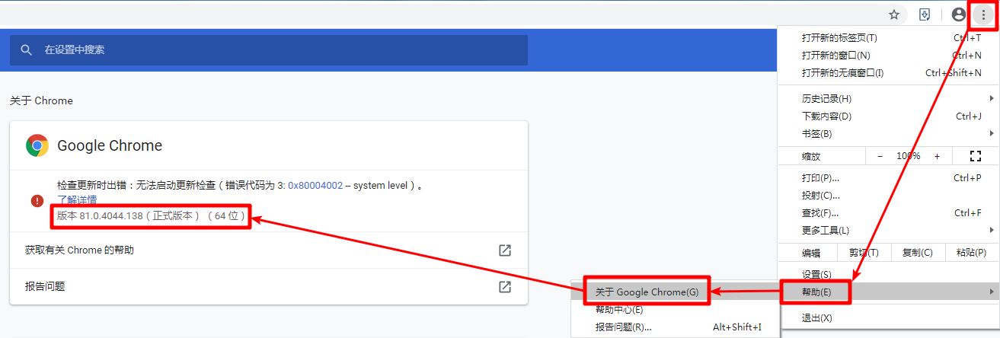

# 简介

业余比赛如王者之志，非公开组只允许非等级运动员报名。

本项目使用Selenium批量查询等级运动员，并输出简易报告。

# 安装

1. Python 的 [`selenium`](https://www.selenium.dev/selenium/docs/api/py/api.html) 库
```shell
pip install selenium
```

2. 安装 [Chrome](https://www.google.cn/chrome/)

3. 查看本机Chrome版本号


4. 安装 Chrome 驱动
<br>根据版本号搜[ChromeDriver Latest Releases Versions Downloads](https://chromedriver.com/download)，
将解压后的 `chromedriver.exe` 放在环境变量 Path 下，如 `C:\Users\Administrator\AppData\Local\Programs\Python\Python38`

5. 测试代码

```python
from selenium import webdriver

driver = webdriver.Chrome()
driver.get('https://www.baidu.com/')
```

# 使用

1. 在文件夹【运动员名单】下新建多个.txt文件，每行一个运动员名称
2. 运行main.py
```shell
python main.py
```

# 效果

示例数据使用[2024年王者之志深圳站运动员名单](https://mp.weixin.qq.com/s/pGZInBVbJ2XsN7aLaoGjEQ)


# 注意事项

1. 人名重复、繁体字、没有注册等原因，可能会导致查不到或查到了但实际该运动员不是等级运动员
2. 爬的量多或过快会报错


# TODO

1. 去重
2. 可视化GUI
3. 截图
4. 生成举报文档，包含链接地址
5. 重试机制
6. 分组输出
7. 可选不输出非等级运动员

# 请我喝杯咖啡

如果你认可我的工作，请我喝杯咖啡以示鼓励和支持


